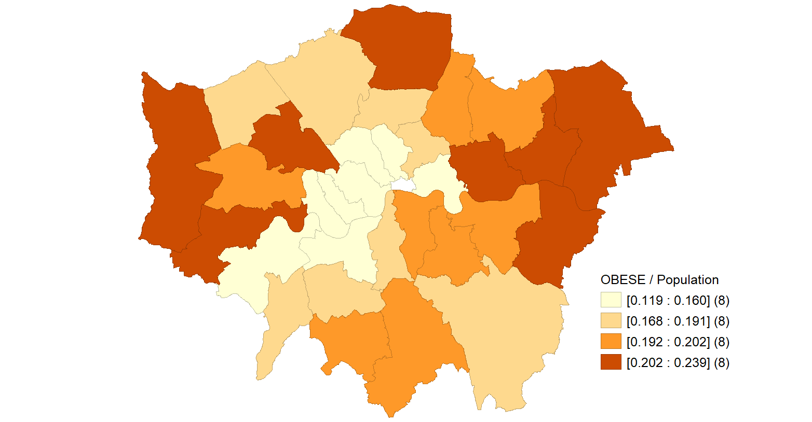
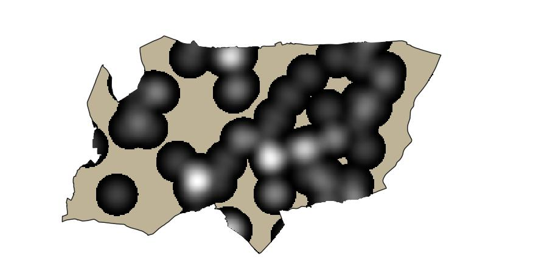
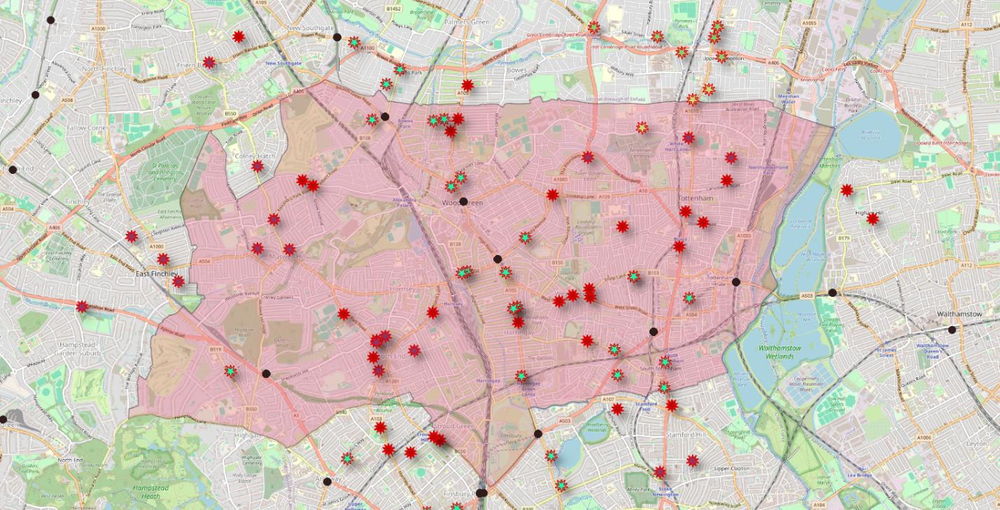
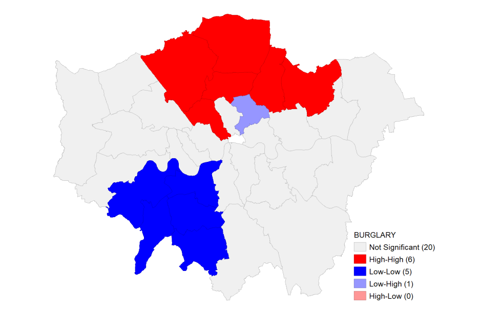
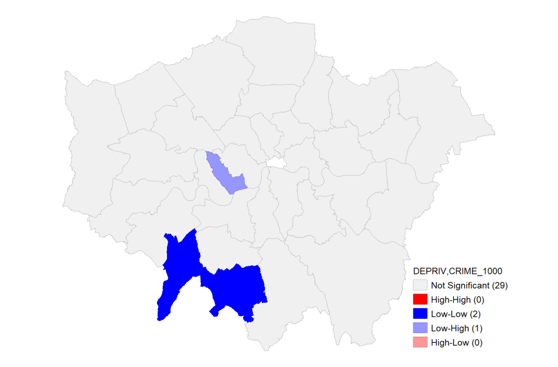
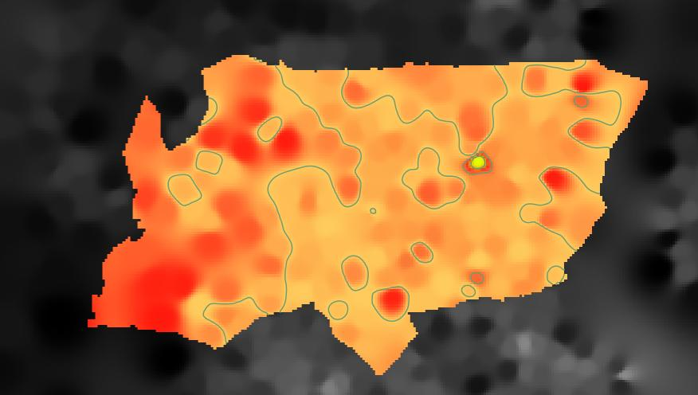

 # London Spatial Data Analysis

## Project Overview

This project explores spatial patterns across London using QGIS, GeoDa and SpatiaLite.

The analysis covers spatial SQL, geoprocessing, thematic mapping, accessibility analysis, spatial autocorrelation, regression and surface interpolation. The portfolio includes examples related to transport, public health, crime, deprivation and population distribution.

## Tools & Technologies

- QGIS
- GeoDa
- SpatiaLite
- Spatial SQL
- GIS
- Spatial Statistics
- Spatial Data Analysis
- Raster Analysis
- Spatial Regression
- Data Visualisation

## Spatial SQL and Geoprocessing

Spatial SQL and GIS operations were used to analyse London boroughs, transport infrastructure and spatial relationships.

Examples include:

- Counting Underground stations by borough
- Identifying motorways intersecting London boroughs
- Finding Underground stations within 1 km of motorways
- Creating motorway buffer zones
- Spatial intersection and overlay operations
- Calculating proximity between GP surgeries and Underground stations

The `sql/` folder contains reconstructed SpatiaLite query examples based on the tasks documented in the project report.

## Public Health Mapping

### Obesity Risk Across London

GeoDa was used to map obesity rates across London boroughs.

The analysis suggested that obesity risk was generally higher in several outer London boroughs, demonstrating how spatial mapping can support targeted public-health planning.

## Healthcare Accessibility Analysis

### GP Surgery Heatmap

Kernel Density Estimation (KDE) was used to identify spatial concentrations of GP surgeries in Haringey.

This analysis highlights differences in the spatial distribution of healthcare facilities across the borough.

### GP Accessibility to Underground Stations

A distance-based accessibility analysis was carried out to examine the relationship between GP surgeries and nearby Underground stations in Haringey.

The results suggested that GP surgeries in central and eastern parts of Haringey had relatively better accessibility to tube stations.

## Spatial Autocorrelation

### Burglary Clusters

Local Moran’s I was used to identify spatial clustering in burglary patterns across London boroughs.

The analysis identified areas showing High-High and Low-Low spatial autocorrelation, indicating that burglary levels in some boroughs were associated with similar values in neighbouring areas.

### Deprivation and Crime

Bivariate Local Moran’s I was used to investigate the spatial relationship between deprivation and crime rates.

The analysis indicated a positive spatial association between deprivation and crime in some parts of London.

## Spatial Regression

Both Ordinary Least Squares and Spatial Lag regression models were examined using health-related variables.

The dependent variable was male life expectancy.

The spatial lag model achieved an R² of approximately 0.804, while the OLS model achieved a similar R² of approximately 0.804.

Among the included predictors, the proportion of people classified as healthy showed the strongest statistically significant positive relationship with male life expectancy in the reported models.

## Surface Analysis and Interpolation

### Population Density Interpolation

IDW interpolation was used to create a continuous population-density surface for Haringey.

The interpolated raster was clipped to the borough boundary and combined with contour lines to highlight areas of relatively high population concentration.

## Key Findings

- Spatial SQL was used to analyse transport and borough-level spatial relationships.
- Public-health mapping revealed geographical variation in obesity risk.
- KDE highlighted clusters of GP surgery locations within Haringey.
- Accessibility analysis showed differences in proximity between GP surgeries and Underground stations.
- Local Moran’s I identified spatial clustering in crime and deprivation indicators.
- Bivariate Moran’s I demonstrated spatial association between deprivation and crime.
- Spatial regression was used to examine relationships between health indicators and male life expectancy.
- IDW interpolation was used to create a continuous population-density surface.

## Repository Structure

- `images/` - selected maps and spatial-analysis outputs
- `report/` - cleaned spatial data analysis portfolio
- `sql/` - reconstructed SpatiaLite query examples
- `README.md` - project overview and findings

## Key Skills Demonstrated

QGIS · GeoDa · SpatiaLite · Spatial SQL · GIS · Spatial Analysis · Spatial Autocorrelation · Moran’s I · Spatial Regression · Kernel Density Estimation · Accessibility Analysis · Raster Analysis · IDW Interpolation · Data Visualisation

## Full Report

The complete spatial data analysis portfolio is available in the `report/` folder.
